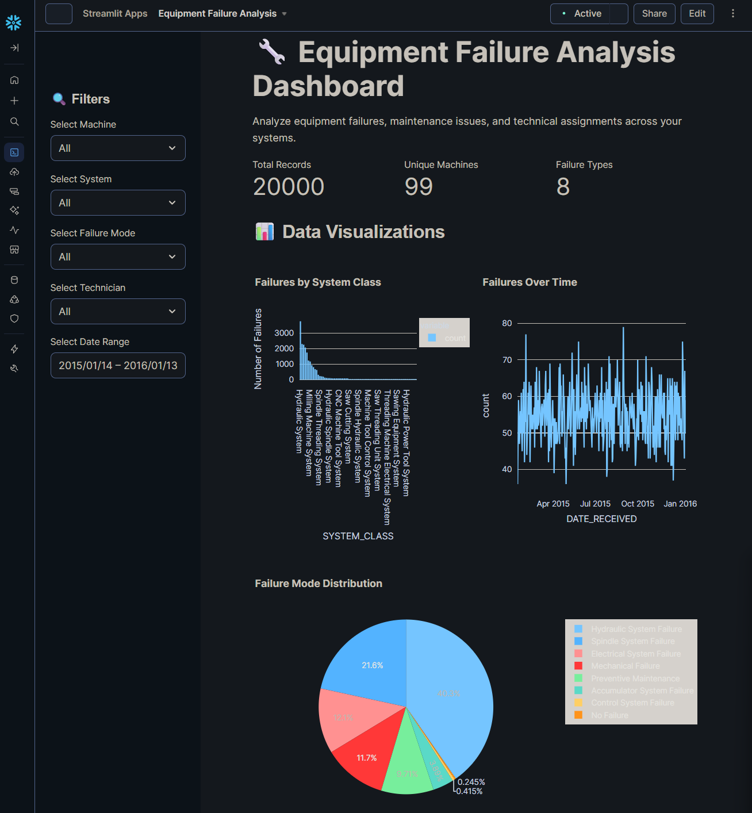
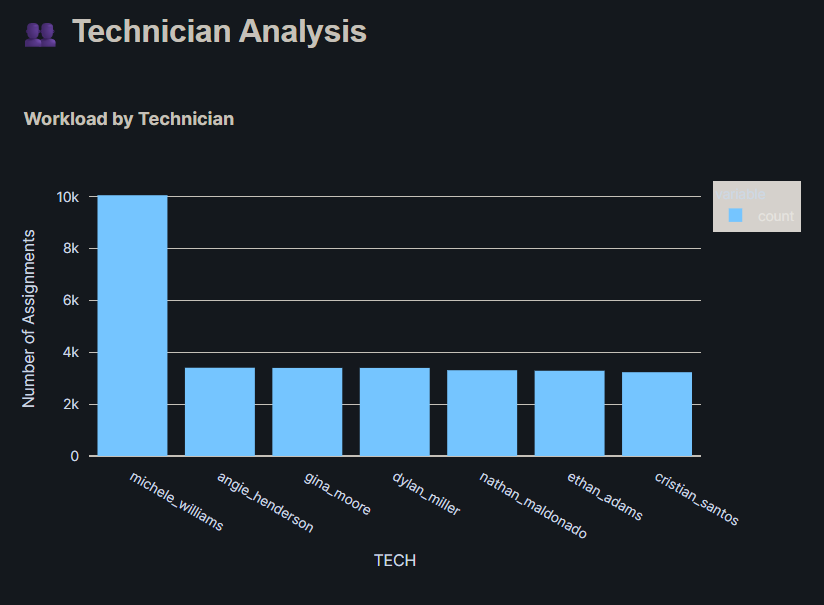
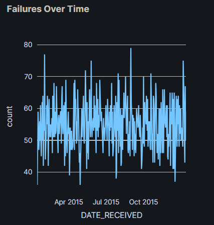
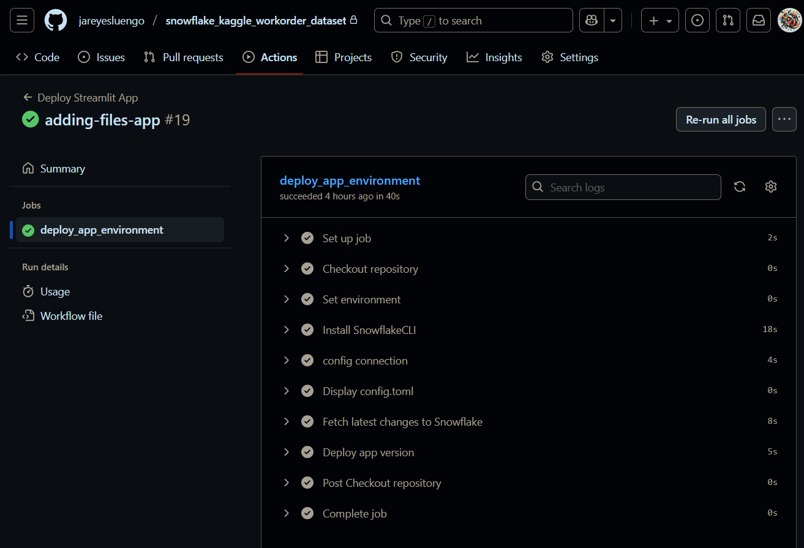

# Maintenance Intelligence Platform: LLM-Driven Failure Analysis
* [LinkedIn: Joel Reyes L.](https://www.linkedin.com/in/joel-reyes-luengo-09903a317/)
## Maintenance Work Orders Dataset
* [Kaggle Dataset](https://www.kaggle.com/datasets/tinhban/maintenance-work-orders-dataset)

## Project Summary
This project is a **Maintenance Intelligence Platform** that leverages modern data engineering and Large Language Models (LLMs) to transform unstructured maintenance work order data into actionable insights. The application automates the classification of failure modes and the identification of affected systems, moving beyond traditional, manual analysis methods.

Built for scalability and reliability, the platform integrates a Snowflake data warehouse, a **Streamlit** front-end application, and a robust **CI/CD pipeline** using **GitHub Actions**. It serves as a powerful demonstration of applying cutting-edge LLM, MLOps, and Data Engineering techniques to solve critical, real-world industrial problems.

## Core Value Proposition
This solution uniquely bridges deep domain expertise in industrial maintenance with advanced technological skills in:

* **LLM (Large Language Model) Application:** Automating the extraction of structured insights from unstructured technician notes.

* **Data Engineering:** Building a reliable data pipeline within Snowflake to process and serve maintenance data.

* **MLOps/DevOps:** Implementing a full CI/CD pipeline for seamless application updates and deployments.

* **Industrial IoT & Analytics:** Providing visualization and analysis tools for failure distribution and trends over time.

## Project Structure

```bash
maintenance-intelligence-platform
├── .github/workflows
├── app
├── data
│   ├── input
│   ├── output
│   └── ingestion
├── dev
├── img
├── README.md
├── requirements.txt
├── LICENSE
└── .gitignore
```

## Key Components Explained:
* **.github/workflows/:** Contains the YAML file that defines the Continuous Integration and Continuous Deployment (CI/CD) process. On every push to the main branch, this pipeline runs tests, builds the application, and deploys it.

* **app/:** The core of the Streamlit application, organized into multiple pages for different analytical views.

## Development & Implementation
### Application Interface
#### Equipment Failure Analysis Dashboard
This page provides a high-level overview of where and how failures are occurring across the plant.



Caption: The Failure Distribution dashboard visualizes the most common failure modes and pinpoints the systems with the highest failure rates, enabling proactive maintenance planning.

#### Technician Analysis Viewer
This section allows users to drill down into the raw data and see the power of the LLM classification firsthand.



Caption: The Technician Analysis page displays the original work order data alongside the automatically classified Failure Mode and System fields. This demonstrates the LLM's ability to understand complex, natural language descriptions from maintenance technicians.

#### Failure Over Time Analysis
This time-series analysis helps identify trends, recurring issues, and the impact of maintenance activities.



Caption: The Failure Over Time analysis tool helps track the frequency of failures, identify seasonal patterns, and measure the effectiveness of interventions or part replacements.

#### Architectural Overview
***System Architecture Diagram***
<ON HOLD>

Caption: High-level system architecture. Unstructured work orders are ingested into Snowflake, where they are processed and classified by an LLM. The structured results are then visualized in the Streamlit app, with the entire process automated via a CI/CD pipeline.

#### Development in Action
***CI/CD Pipeline Success***


Caption: A successful run of the CI/CD pipeline in GitHub Actions. This ensures that every change to the codebase is automatically tested and deployed, maintaining high code quality and a reliable deployment process.

## Skills Demonstrated
> **LLM & AI:** Practical application of an LLM for text classification and information extraction in a industrial context.

> **Data Engineering:** Design and implementation of a data processing pipeline in Snowflake.

> **MLOps & DevOps:** Creation of an end-to-end CI/CD pipeline for an ML-powered application.

> **Application Development:** Building an interactive and user-friendly web application with Streamlit.

> **Cloud Data Warehousing:** Expertise in using Snowflake for data storage, processing, and analysis.

> **Domain Knowledge:** Leveraging 10+ years of experience in mining plant maintenance to build a genuinely useful and relevant tool.

***For questions or collaboration opportunities, please feel free to open an issue or contact me directly.***

